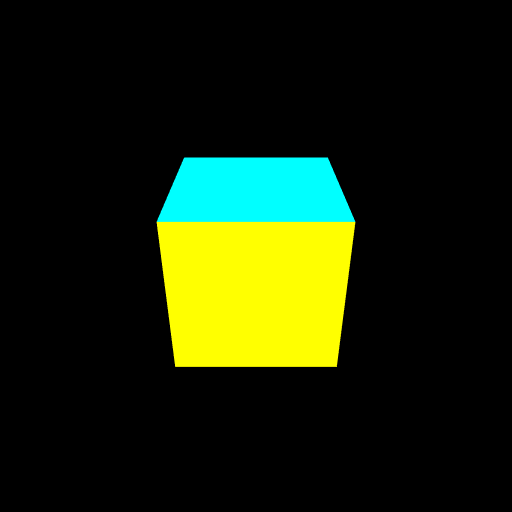

# カメラ
カメラを仮想世界で飛ばして3Dの世界を眺めてみます。

https://webglstudy.github.io/06_camera/

# 課題
次の問題に挑戦してみてください。

- カメラ動きを変えてみよう

# 課題の進め方
次のように課題を解いてみてください。

- プロジェクトをforkします
- GitHub Pages の機能を使って、ホームページを立ち上げます
- 問題を解きます
- GitHub Pages で正答したか確認しましょう
